# 🛒 Deshi Gadgets

[](LICENSE)
[](https://www.oracle.com/java/technologies/downloads/)
[](https://maven.apache.org/)
[](https://www.mysql.com/)

**Deshi Gadgets** is a full-stack e-commerce web application for browsing, carting, and ordering electronic gadgets online. Built with Java Servlets, JSP, JDBC, and MySQL, it features role-based access for customers and admins, a shopping cart, order management, inventory tracking, and automated email notifications.

> **Note:** The payment page is for demonstration purposes only and is not connected to a real payment gateway.

---

## 📑 Table of Contents

- [Features](#-features)
- [Tech Stack](#-tech-stack)
- [Architecture](#-architecture)
- [Project Structure](#-project-structure)
- [Prerequisites](#-prerequisites)
- [Getting Started](#-getting-started)
- [Configuration](#%EF%B8%8F-configuration)
- [Database Schema](#-database-schema)
- [Screenshots](#-screenshots)
- [Contributing](#-contributing)
- [Contributors](#-contributors)
- [License](#-license)

---

## ✨ Features

### Customer
- **Account Management** — Register, log in, view and update profile
- **Product Browsing** — View all products, search by name, filter by category
- **Shopping Cart** — Add products, update quantities, remove items
- **Order Placement** — Checkout with demo payment, view order history and shipping status
- **Email Notifications** — Receive emails on registration, order placement, shipment, and product restocking

### Admin
- **Product Management** — Add, update, and remove products with image uploads
- **Inventory Control** — Monitor and manage stock levels
- **Order Management** — View all orders, mark orders as shipped
- **Demand Tracking** — Automatically notify customers when out-of-stock products are restocked

---

## 🛠 Tech Stack

| Layer | Technology |
|-------|-----------|
| **Frontend** | JSP, HTML, CSS, JavaScript, Bootstrap 4 |
| **Backend** | Java 8+, Servlets, JDBC |
| **Database** | MySQL 8.0 |
| **Build** | Apache Maven |
| **Email** | Jakarta Mail (SMTP) |
| **Server** | Apache Tomcat 8.0+ |

### Dependencies

| Dependency | Version | Purpose |
|-----------|---------|---------|
| `mysql-connector-java` | 8.0.33 | MySQL JDBC driver |
| `javax.servlet-api` | 3.1.0 | Servlet API |
| `jakarta.mail-api` | 2.1.1 | Email API |
| `jakarta.mail` (Sun) | 2.0.1 | Email implementation |
| `jaxws-api` | 2.3.1 | XML web services |
| `commons-codec` | 1.15 | Encoding utilities |

---

## 🏗 Architecture

The project follows a layered **MVC (Model-View-Controller)** architecture:

```
┌──────────────────────────────────┐
│      JSP Pages (View)            │
├──────────────────────────────────┤
│      Servlets (Controller)       │
├──────────────────────────────────┤
│   Service Layer (Business Logic) │
├──────────────────────────────────┤
│   Data Access (JDBC + DBUtil)    │
├──────────────────────────────────┤
│        MySQL Database            │
└──────────────────────────────────┘
```

- **Model** — Java Bean classes (`beans/`) represent data entities
- **View** — JSP pages render the UI with Bootstrap styling
- **Controller** — Servlet classes (`srv/`) handle HTTP requests and delegate to services
- **Service** — Interfaces (`service/`) and implementations (`service/impl/`) contain business logic and database operations

---

## 📁 Project Structure

```
Software-Development-3/
├── src/
│   └── com/mehedi/
│   │   ├── beans/                  # Data models (POJOs)
│   │   │   ├── UserBean.java       # User profile model
│   │   │   ├── ProductBean.java    # Product catalog model
│   │   │   ├── CartBean.java       # Shopping cart item model
│   │   │   ├── OrderBean.java      # Order model
│   │   │   ├── OrderDetails.java   # Extended order details
│   │   │   ├── TransactionBean.java# Transaction/payment model
│   │   │   └── DemandBean.java     # Out-of-stock demand tracker
│   │   ├── service/                # Service interfaces
│   │   │   └── impl/              # Service implementations (JDBC)
│   │   ├── srv/                    # Servlet controllers
│   │   ├── utility/                # Helpers (DB connection, email, ID generation)
│   │   └── constants/              # Database column constants
│   └── application.properties      # DB & mail configuration
├── WebContent/
│   ├── index.jsp                   # Landing page
│   ├── login.jsp / register.jsp    # Authentication pages
│   ├── userHome.jsp                # Customer dashboard
│   ├── cartDetails.jsp             # Shopping cart page
│   ├── payment.jsp                 # Demo payment page
│   ├── orderDetails.jsp            # Order history page
│   ├── adminViewProduct.jsp        # Admin product management
│   ├── addProduct.jsp              # Admin add product form
│   ├── css/                        # Bootstrap CSS
│   ├── js/                         # Bootstrap JS
│   ├── images/                     # Product & UI images
│   └── WEB-INF/
│       ├── web.xml                 # Servlet configuration
│       └── lib/                    # JAR dependencies
├── databases/
│   ├── mysql_query.sql             # Database schema & seed data
│   └── SHOPPING_CART_ERD.mwb       # MySQL Workbench ER model
├── Documentations/                 # Diagrams & project docs
├── OUTPUT/                         # Application screenshots
├── pom.xml                         # Maven build configuration
└── LICENSE                         # Apache License 2.0
```

---

## 📋 Prerequisites

Ensure you have the following installed:

| Tool | Version | Download |
|------|---------|----------|
| Git | Latest | [git-scm.com](https://git-scm.com/downloads) |
| Java JDK | 8 or higher | [oracle.com](https://www.oracle.com/java/technologies/downloads/) |
| Apache Maven | 3.6+ | [maven.apache.org](https://maven.apache.org/download.cgi) |
| Apache Tomcat | 8.0+ | [tomcat.apache.org](https://tomcat.apache.org/download-90.cgi) |
| MySQL Server | 5.7+ | [dev.mysql.com](https://dev.mysql.com/downloads/mysql/) |
| MySQL Workbench | Latest | [dev.mysql.com](https://dev.mysql.com/downloads/workbench/) |
| Eclipse EE | Latest (optional) | [eclipse.org](https://www.eclipse.org/downloads/) |

---

## 🚀 Getting Started

### 1. Clone the Repository

```bash
git clone https://github.com/0mehedihasan/Software-Development-3.git
cd Software-Development-3
```

### 2. Set Up the Database

Open MySQL Command Prompt or MySQL Workbench and log in:

```bash
mysql -u <username> -p
```

Run the schema script:

```sql
source databases/mysql_query.sql;
```

This creates the `shopping-cart` database with all required tables and sample data.

### 3. Generate a Gmail App Password (for Email Features)

1. Log in to your [Google Account Security](https://myaccount.google.com/security) settings
2. Enable **2-Step Verification** if not already enabled
3. Go to [App Passwords](https://myaccount.google.com/apppasswords)
4. Select **Other (Custom name)**, enter `Deshi Gadgets`, and click **Generate**
5. Copy the 16-character password — you will need it in the next step

> ⚠️ Do not share or commit your app password. Your regular Gmail password will not work.

### 4. Configure the Application

Edit `src/application.properties`:

```properties
db.url=jdbc:mysql://localhost:3306/shopping-cart
db.username=YOUR_MYSQL_USERNAME
db.password=YOUR_MYSQL_PASSWORD

mailer.email=YOUR_GMAIL_ADDRESS
mailer.password=YOUR_APP_PASSWORD
```

### 5. Build and Run

#### Option A: Using Maven + Tomcat (Command Line)

```bash
mvn clean install
```

Deploy the generated `target/shopping-cart-0.0.1-SNAPSHOT.war` to your Tomcat `webapps/` directory (rename it to `Deshi-Gadgets.war` to match the expected context path) and start Tomcat.

#### Option B: Using Eclipse EE

1. **Import:** File → Import → Git → Projects from Git → Clone URI → paste the repo URL → select `master` branch → Finish
2. **Build:** Right-click project → Run As → Maven Build → Goals: `clean install` → Run
3. **Fix dependencies (if needed):** Right-click project → Build Path → Configure Build Path → resolve any red-marked libraries
4. **Update Maven:** Right-click project → Maven → Update Project → check "Force Update" → OK
5. **Run on Tomcat:** Right-click project → Run As → Run on Server → select Tomcat 8.0+ → Finish

### 6. Access the Application

Open your browser and navigate to:

```
http://localhost:8080/Deshi-Gadgets/
```

> If port `8080` is in use, change it in Tomcat's `server.xml` (or in Eclipse: Server tab → double-click Tomcat → Ports → change HTTP/1.1 port).

### Default Credentials

| Role | Email | Password |
|------|-------|----------|
| Admin | `admin@gmail.com` | `admin` |
| Customer | `guest@gmail.com` | `guest` |

---

## ⚙️ Configuration

All application settings are in `src/application.properties`:

| Property | Description |
|----------|-------------|
| `db.url` | JDBC connection URL for MySQL |
| `db.username` | MySQL username |
| `db.password` | MySQL password |
| `mailer.email` | Gmail address for sending notifications |
| `mailer.password` | Gmail app password (not regular password) |

---

## 🗄 Database Schema

The application uses a MySQL database named `shopping-cart` with the following tables:

```
┌──────────┐     ┌──────────────┐     ┌──────────┐
│   user   │     │   usercart   │     │ product  │
├──────────┤     ├──────────────┤     ├──────────┤
│ email PK │◄────│ username FK  │     │ pid PK   │
│ name     │     │ prodid FK    │────►│ pname    │
│ mobile   │     │ quantity     │     │ ptype    │
│ address  │     └──────────────┘     │ pinfo    │
│ pincode  │                          │ pprice   │
│ password │     ┌──────────────┐     │ pquantity│
└──────────┘     │   orders     │     │ image    │
      │          ├──────────────┤     └──────────┘
      │          │ orderid FK   │           │
      │          │ prodid FK    │───────────┘
      │          │ quantity     │
      │          │ amount       │
      │          │ shipped      │
      │          └──────────────┘
      │
      │          ┌──────────────┐
      │          │ transactions │
      └─────────►├──────────────┤
      │          │ transid PK   │
      │          │ username FK  │
      │          │ time         │
      │          │ amount       │
      │          └──────────────┘
      │
      │          ┌──────────────┐
      └─────────►│ user_demand  │
                 ├──────────────┤
                 │ username FK  │
                 │ prodid FK    │
                 │ quantity     │
                 └──────────────┘
```

### ER Diagram


### Use Case Diagram


### Class Diagram


### WBS Diagram

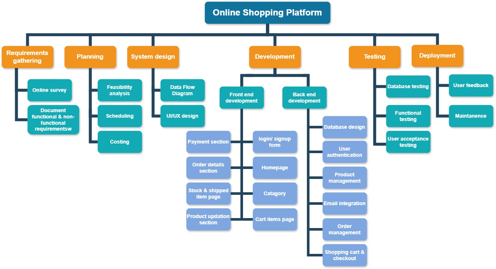

---

## 📸 Screenshots

<details>
<summary><strong>Admin Panel</strong></summary>

| View | Screenshot |
|------|-----------|
| Home Page | 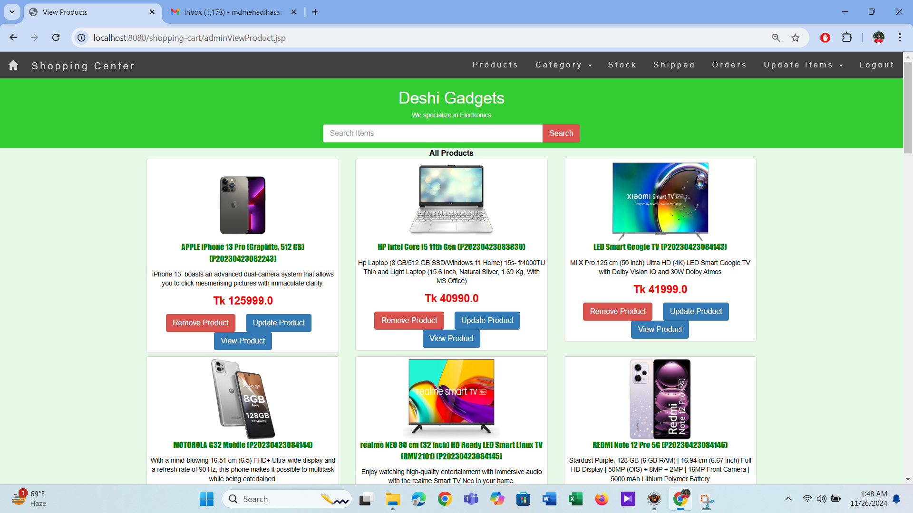 |
| Product View | 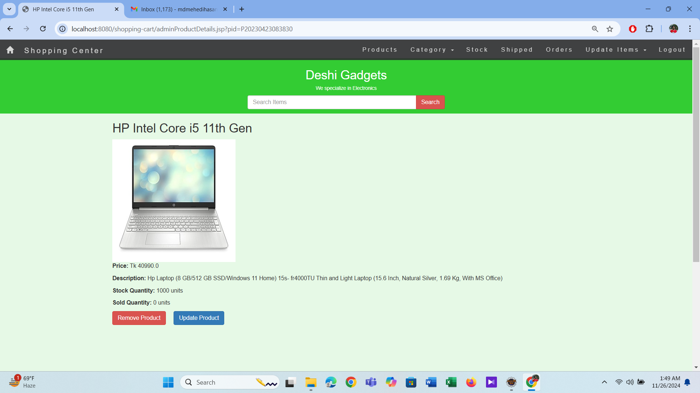 |
| Product Update | 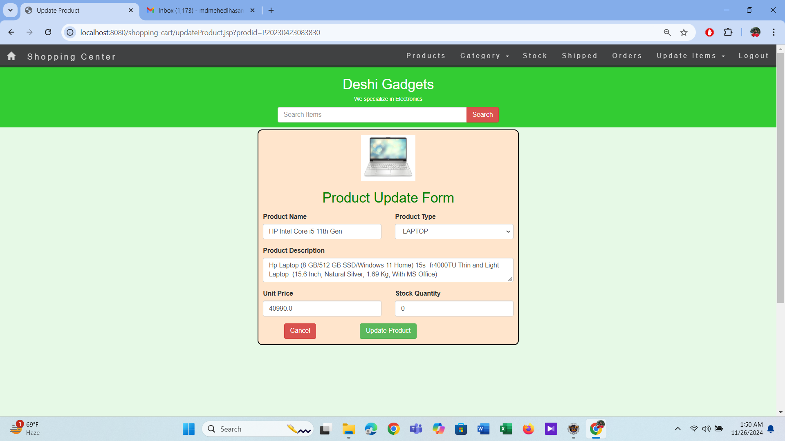 |
| Stock Management | 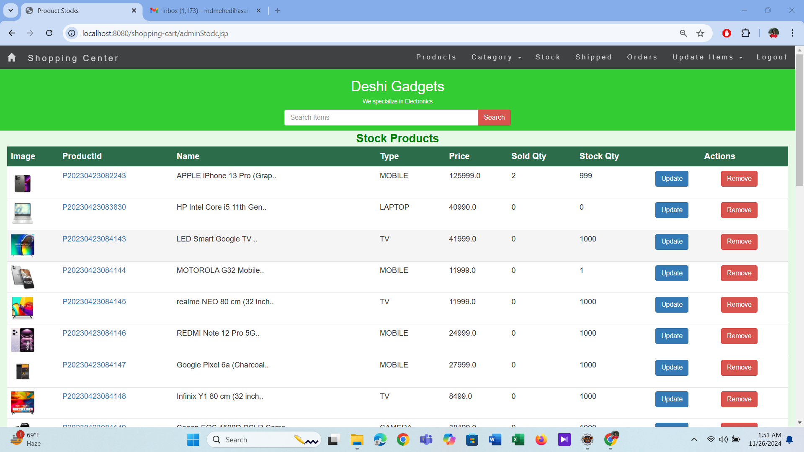 |
| Unshipped Orders |  |
| Shipped Orders | 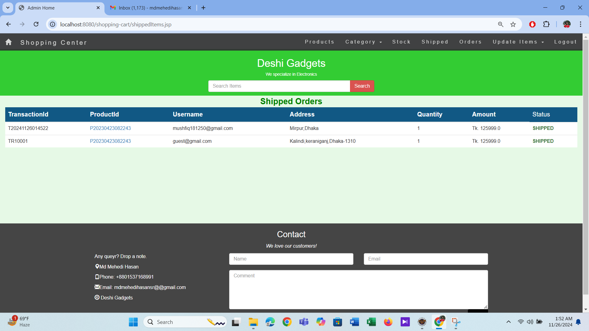 |
| Add Product | 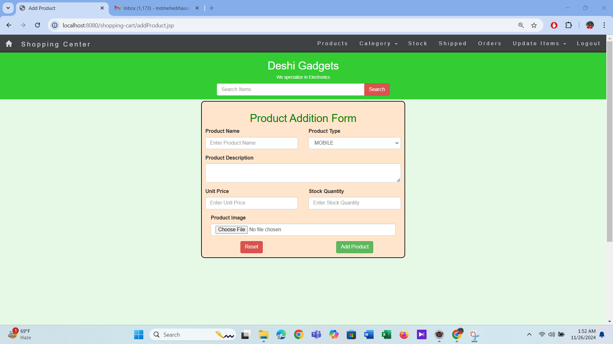 |

</details>

<details>
<summary><strong>Customer Portal</strong></summary>

| View | Screenshot |
|------|-----------|
| Registration | 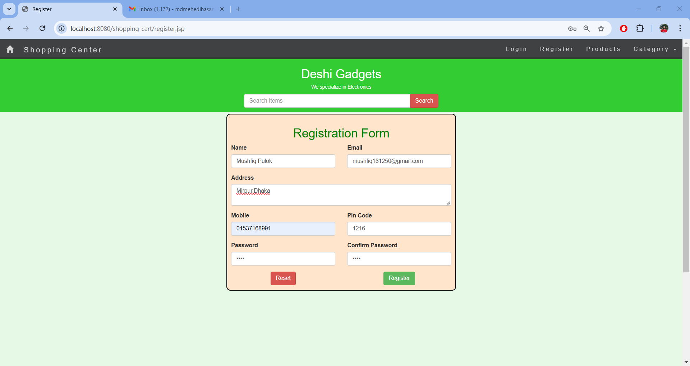 |
| Login | 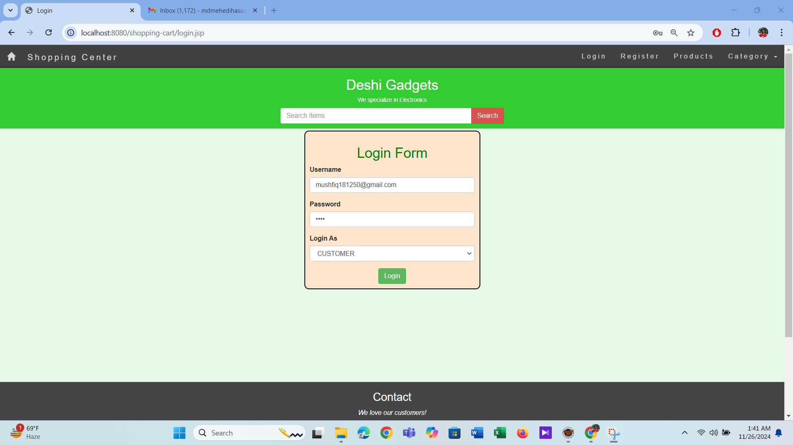 |
| Home Page | 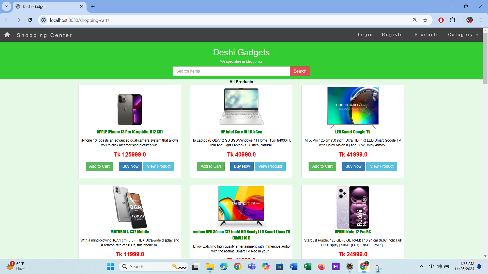 |
| Product Details | 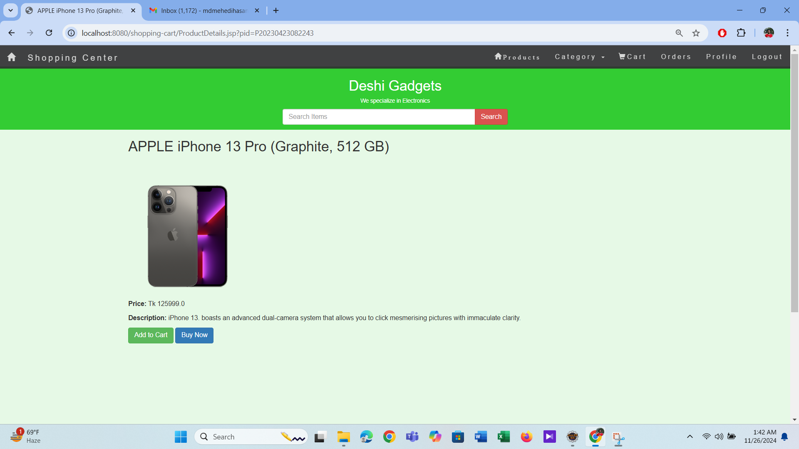 |
| Shopping Cart | 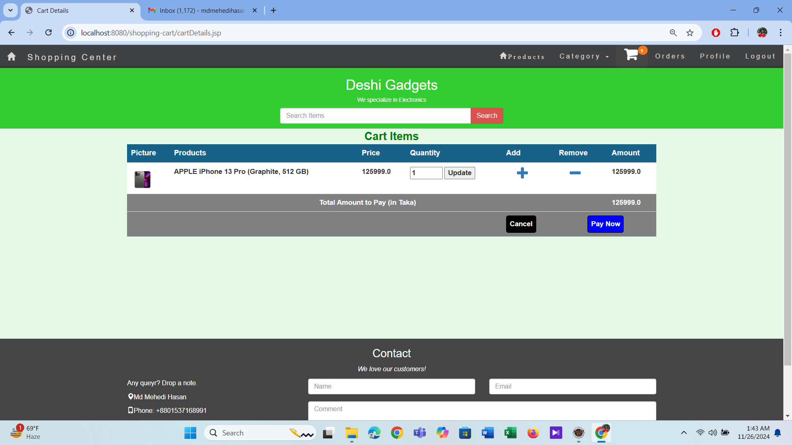 |
| Payment | 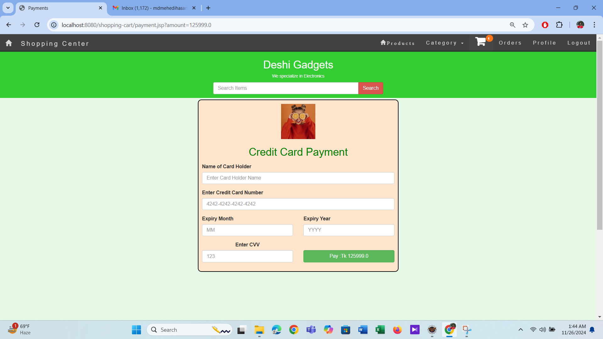 |
| Order Details | 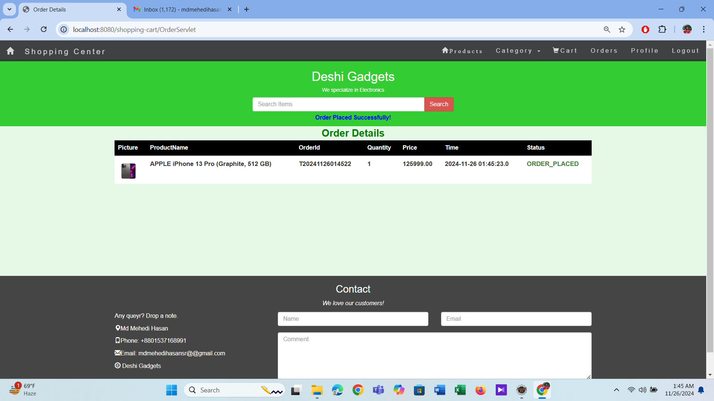 |
| User Profile | 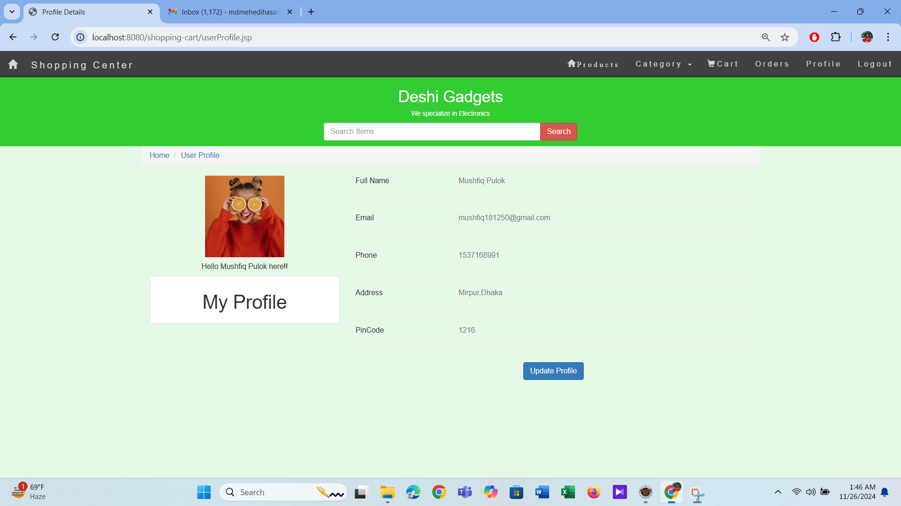 |
| Update Profile | 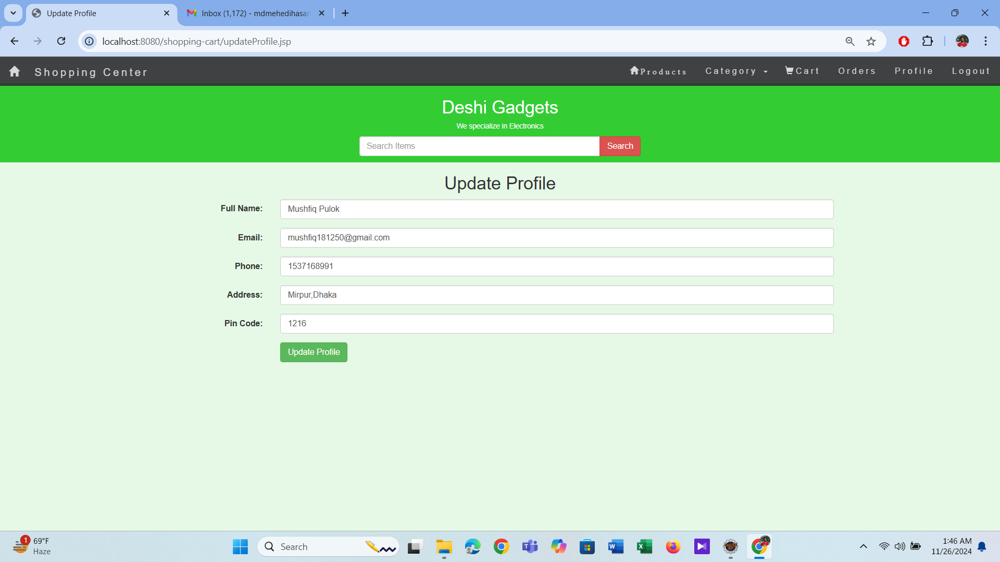 |

</details>

---

## 🤝 Contributing

Contributions are welcome! Whether you want to fix bugs, add new features, improve documentation, or share ideas — every contribution makes a difference.

### How to Contribute

1. **Fork** the repository
2. **Create** a feature branch
   ```bash
   git checkout -b feature/your-feature-name
   ```
3. **Make** your changes and commit
   ```bash
   git commit -m "Add: brief description of changes"
   ```
4. **Push** to your fork
   ```bash
   git push origin feature/your-feature-name
   ```
5. **Open** a Pull Request against the `master` branch

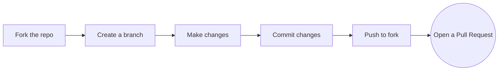

### Contribution Ideas

- 🔐 Add password hashing/encryption
- 💳 Integrate a real payment gateway
- 🧪 Add unit and integration tests
- 📱 Make the UI fully responsive
- 🔍 Improve product search with pagination
- 🐳 Add Docker support for easier setup
- 📝 Improve inline code documentation

---

## 👥 Contributors

<table>
  <tr>
    <td align="center">
      <a href="https://github.com/0mehedihasan">
        <br />
        <sub><b>Md Mehedi Hasan</b></sub>
      </a>
    </td>
    <td align="center">
      <a href="https://github.com/mushfiq525">
        <br />
        <sub><b>mushfiq525</b></sub>
      </a>
    </td>
    <td align="center">
      <a href="https://github.com/Abdullahanim17">
        <br />
        <sub><b>Abdullah Al Hill Baki Anim</b></sub>
      </a>
    </td>
    <td align="center">
      <a href="https://github.com/pranto-9">
        <br />
        <sub><b>Mehedi Hasan Pranto</b></sub>
      </a>
    </td>
    <td align="center">
      <a href="https://github.com/Adeeba333">
        <br />
        <sub><b>Mahmuda Adeeba Tul Husna</b></sub>
      </a>
    </td>
  </tr>
</table>

---

## 📄 License

This project is licensed under the **Apache License 2.0** — see the [LICENSE](LICENSE) file for details.

---

<p align="center">
  ⭐ If you find this project useful, please consider giving it a star!
</p>
